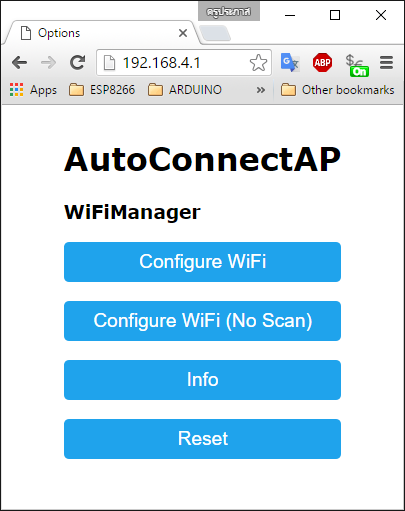
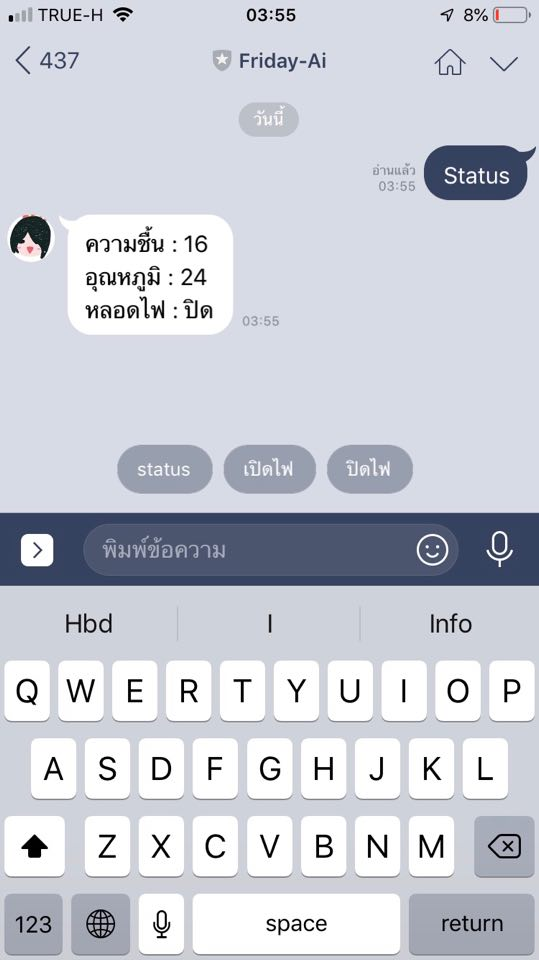

# ⚠️ Security Door Alert ⚠️
## Add friends our bot in Line

## Abstract
ในปัจจุบันเราปฏิเสธไม่ได้ว่าเทคโนโลยีได้เข้ามามีบทบาทในชีวิตประจำวันมากขึ้นการเข้ามามีบทบาทของ internet of think ก็ทำให้การยกระดับความปลอดภัยในที่อยู่อาศัยทำได้ง่ายและราคาต่ำเข้าถึงง่ายเราจึงจัดทำโปรเจ็คนี้เพื่อยกระดับความปลอดภัยในบ้านที่ใช้ได้จริงและเข้าถึงง่ายเหมาะสมกับทุกครัวเรือนและป้องภัยที่อาจเกิดขึ้นได้บ้านอย่างครอบคลุมใ เราจะได้คิดค้น Friday-AI ผู้ช่วยที่คอยดูแลบ้านของเรา จะคอยรายงานถึงความปกติให้เราสามารถทราบตลอดแม้เราไม่อยู่บ้าน

## Object
เพื่อยกระดับความปลอดภัยภายในบ้านและตรวจสถานะผิดปกติ

## Feature
* สามารถเปิด-ปิดไฟผ่านไลน์ได้
* เช็คสถานะอุณภูมิและความชื้นภายในบ้าน
* เมื่อมีคนเข้ามาในบ้านจะมีการแจ้งเตือนผ่านไลน์
* จะมีการแจ้งเตือนเมื่อมีความผิดปกติในบ้านที่เสี่ยงต่อการเปิดอัคคีภัย
* เมื่อไม่มี Wi-FI น้องFriday-Aiจะทำการปล่อยAPเพื่อให้ผู้ใช้งานเข้ามาConfigแก้ไขไวไฟได้
 ภาพตัวอย่างหน้าConfigure

## How to use
1. เพิ่มเพื่อนFriday-Aiผู้ช่วยสุดเก่งของคุณตาม Qr-code ข้างต้น
2. สามารถกดสั่งการบอทผ่าน quick reply bottonได้เลยดังรูป

## Statistics

**Project Started:** 10 April 2019

**Project Status:** Completed

**Main Language:** C

## Group Members

|||||
|:---:|:---:|:---:|:---:|
|[Poom](https://github.com/Kuroishi1221)|[MAI](https://github.com/toplordsaito)|[Great](https://github.com/Phakapol)|[Guy](https://github.com/Alhzz)|
|Ratchanon Chumbunyeanyong|Waruwat Chaidit|Phakapol Tanhawattana|Ason Uthatham|
|61070182|61070214|61070153|61070262|
